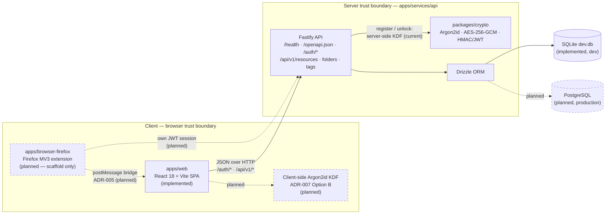

# Password Manager

Self-hosted, encrypted password manager — built by a Hermes AI team.

> **Status legend used throughout this README**
> **Implemented** = merged into `master` and exercised by the Quick Start or tests.
> **Planned** = designed (ADR / Kanban card) but not yet merged into `master`.

## Project Overview

A Passbolt-inspired, local / self-hosted, single-user vault manager focused on a
small, safe surface. V1 scope is defined in [PROJECT_BRIEF.md](PROJECT_BRIEF.md).

### Feature status

| Area | Status | What exists on `master` today |
|---|---|---|
| **API backend** (`apps/services/api`) | **Implemented** | Fastify 5 + Drizzle ORM over SQLite. Routes: `GET /health`, `GET /openapi.json`, `POST /auth/register`, `POST /auth/unlock`, `POST /auth/lock`, `POST /auth/refresh`, `GET /auth/status`, and authenticated `/api/v1/resources`, `/api/v1/folders`, `/api/v1/tags`. |
| **Web UI** (`apps/web`) | **Implemented** | React 18 + TypeScript + Vite SPA with pages for login/unlock, vault (resources, with search), folders, tags, password generator and settings. See the dev-server caveat in [Quick Start](#quick-start). |
| **Crypto primitives** (`packages/crypto`) | **Implemented (server-side use)** | Argon2id KDF, AES-256-GCM AEAD, HMAC-SHA256 / JWT helpers. Used by the API at register/unlock. |
| **Client-side key derivation (end-to-end encryption)** | **Planned** | [ADR-007](architecture/adr/ADR-007-vault-key-client-availability.md) is *Accepted — Option B* (real client-side KDF; the server never computes or sees the key). **Not yet wired:** today `/auth/register` and `/auth/unlock` receive the master password and run the KDF on the server. |
| **Firefox WebExtension** (`apps/browser-firefox`) | **Planned** | Only a Manifest V3 `manifest.json` + `package.json` scaffold exists. Capture/autofill and the Web ↔ extension bridge are designed in [ADR-002](architecture/adr/ADR-002-overall-architecture.md) §6 and [ADR-005](architecture/adr/ADR-005-extension-bridge-protocol.md) but not implemented. |
| **PostgreSQL** production database | **Planned** | V1 development uses SQLite only. |
| **Multi-device sync, groups/sharing, Chrome support, TOTP** | **Planned (Phase 4)** | Deferred — see [PROJECT_BRIEF.md](PROJECT_BRIEF.md) §6. |

### Design principles

- Symmetric AEAD with a vault key derived from the master password — **not** OpenPGP.
- No server-side keyring recovery.
- **Target (ADR-007 Option B):** the server never sees the master password or the
  vault key. **The current implementation does not meet this yet** — see the
  feature-status table above.
- A full vault manager: password generation is a feature, not the product.

See [ADR-001](architecture/adr/ADR-001-functional-patterns-from-passbolt.md) for the
Passbolt functional-pattern audit (what was adopted vs. rejected).

### Stack

| Layer | Technology | Status |
|---|---|---|
| API | Node.js 22 + TypeScript + Fastify 5 + Drizzle ORM | Implemented |
| Web UI | React 18 + TypeScript + Vite, TanStack Query, Zustand | Implemented |
| Crypto primitives | `packages/crypto` (`argon2`, AES-256-GCM, HMAC/JWT) | Implemented |
| Shared types | `packages/shared` | Implemented (types) |
| Database (dev) | SQLite via `better-sqlite3` | Implemented |
| Database (production target) | PostgreSQL | Planned |
| Firefox extension | Manifest V3 + WebExtensions API | Planned (scaffold only) |

### Monorepo layout

```
apps/web/                 # React frontend (implemented)
apps/browser-firefox/     # Firefox MV3 extension (planned — manifest scaffold only)
apps/services/api/        # Node/TypeScript API (implemented)
packages/shared/          # Shared contracts and types
packages/crypto/          # Isolated crypto primitives
tests/                    # e2e, integration, security, fixtures, coverage gates
docs/                     # Process docs and decision records
architecture/adr/         # Architecture Decision Records
```

## Architecture Diagram

Current state of `master`. Solid lines are **implemented**; dashed lines and nodes
marked *planned* are **not yet implemented**. The authoritative description is
[ADR-002](architecture/adr/ADR-002-overall-architecture.md), with the crypto boundary
in [SEC-001](architecture/adr/SEC-001-threat-model.md) and
[ADR-007](architecture/adr/ADR-007-vault-key-client-availability.md).



## Prerequisites

| Tool | Version | Notes |
|---|---|---|
| **Node.js** | **22.x** (pinned in [`.nvmrc`](.nvmrc) and CI `NODE_VERSION`; `engines.node` is `>=22 <23`) | Quick Start verified with Node **22.23.3**. Node 26 is known to break the web test suites (jsdom `AbortSignal` vs. the `undici`-backed global `fetch`); Node 23–25 are untested. `pnpm install` refuses unsupported versions (`ERR_PNPM_UNSUPPORTED_ENGINE`, `engine-strict=true` in [`.npmrc`](.npmrc)). `nvm use` or `fnm use` reads `.nvmrc`. |
| **pnpm** | **9.12.0** (pinned via `packageManager`; `engines.pnpm` is `>=9.0.0`) | Enable with `corepack enable`, or run ad hoc with `npx pnpm@9.12.0 …`. |
| **Git** | any recent 2.x | For cloning. |
| **Docker** | **not required** | The V1 dev database is SQLite with zero external infrastructure. There is no Docker / Docker Compose setup on `master`; a PostgreSQL-based setup is **planned**, so no Docker version is pinned yet. |
| **Firefox** | **no minimum pinned yet** | Only needed for the **planned** WebExtension. The manifest is Manifest V3 and sets no `strict_min_version`; Firefox enables MV3 by default from release 109, so use a current release. A minimum version will be pinned when the extension ships. |
| **Playwright browsers** | managed by the repo | Only for `pnpm test:e2e`; install them with `pnpm test:e2e:install`. |

**Platform notes**

- **Linux** (Ubuntu is the team's reference environment): `better-sqlite3` and
  `argon2` are native modules. They normally install from prebuilt binaries; if no
  prebuild matches your platform, install a C/C++ toolchain and Python
  (`sudo apt install build-essential python3`) so they can compile from source.
- **macOS:** install the Xcode Command Line Tools (`xcode-select --install`) for the
  same native-module fallback.
- **Windows:** use [WSL2](https://learn.microsoft.com/en-us/windows/wsl/) with an
  Ubuntu distribution and follow the Linux notes. Native Windows is untested.

## Quick Start

A fresh-machine walkthrough. Verified on 2026-10-10 on Linux in a fresh clone of
`master` at `559ccd3`, with Node 22.23.3 and pnpm 9.12.0: dependency install took
about 1 min 41 s, and the whole walkthrough well under 10 minutes.

```bash
# 1. Clone
git clone https://github.com/zeldadil/password-manager.git
cd password-manager

# 2. Use the pinned Node version (reads .nvmrc -> 22)
nvm install && nvm use

# 3. Install dependencies (pnpm 9.12.0 via corepack, or: npx pnpm@9.12.0 install)
corepack enable
pnpm install

# 4. Create the SQLite dev database schema (writes apps/services/api/dev.db)
pnpm --filter @password-manager/api migrate

# 5. Run the API and the Web UI together (watch mode)
pnpm dev
```

`pnpm dev` starts:

- the **API** on `http://127.0.0.1:3000`, and
- the **Web UI** (Vite) on `http://localhost:5173` (if 5173 is taken, Vite picks the
  next free port and prints the actual URL).

### Check that it works

In a second terminal (all values below are **synthetic**):

```bash
# API health -> {"status":"ok","version":"0.1.0",...}
curl http://127.0.0.1:3000/health

# Register a synthetic user -> HTTP 201 with id, email, username, kdfParams
curl -X POST http://127.0.0.1:3000/auth/register \
  -H 'content-type: application/json' \
  -d '{"email":"alice@example.test","username":"alice","masterPassword":"correct-horse-battery-staple"}'

# Unlock -> HTTP 200 with accessToken, refreshToken, expiresIn, tokenType "Bearer"
curl -X POST http://127.0.0.1:3000/auth/unlock \
  -H 'content-type: application/json' \
  -d '{"email":"alice@example.test","masterPassword":"correct-horse-battery-staple"}'
```

The OpenAPI document is served at `http://127.0.0.1:3000/openapi.json`.

> **Known gap — Web UI ↔ API under `pnpm dev`.** The Web UI calls the API with
> relative URLs (`/auth/*`, `/api/v1/*`), but `apps/web/vite.config.ts` configures no
> dev proxy. The Web UI page loads on port 5173, but its API calls go to the Vite
> server instead of the API on port 3000, so login/unlock **from the browser does not
> work yet** in local dev. Use the `curl` checks above to exercise the API until a
> dev proxy (or equivalent) is added.

### Configuration (optional)

The API needs no configuration for local development. It reads these environment
variables and falls back to the defaults shown:

| Variable | Default | Purpose |
|---|---|---|
| `PORT` | `3000` | API listen port |
| `HOST` | `127.0.0.1` | API bind interface |
| `NODE_ENV` | `development` | `development` \| `test` \| `production` |
| `DATABASE_URL` | `./dev.db` | SQLite **file path**, relative to `apps/services/api` |
| `AUTO_LOCK_TIMEOUT_MS` | `900000` (15 min) | Auto-lock idle timeout |
| `JWT_SECRET` | built-in development fallback | Token signing secret. **Required when `NODE_ENV=production`** (the API refuses to sign tokens without it). |

Nothing in the repository loads a `.env` / `.env.local` file automatically (no
dotenv, no `--env-file`). To override values from a file, copy
[`.env.example`](.env.example) and **export** its variables into your shell
from the repository root, then run the pnpm commands in that same shell:

```bash
cp .env.example .env.local        # edit .env.local (synthetic values only)
set -a; . ./.env.local; set +a    # export every variable defined in the file
pnpm --filter @password-manager/api migrate
pnpm dev
```

The exports only last for that shell session. For a one-off override, prefix the
command instead, e.g. `PORT=3001 pnpm dev`.

`DATABASE_URL` must be a plain file path such as `./dev.db` (the value in
`.env.example`), not a `file:` URL: `better-sqlite3` treats `file:./dev.db` as a
literal path and fails with *"Cannot open database because the directory does not
exist"*.

### Common commands

| Command | Purpose |
|---|---|
| `pnpm dev` | Run API + Web UI together (watch mode) |
| `pnpm build` | Build all workspaces |
| `pnpm lint` / `pnpm typecheck` | Lint and type-check all workspaces |
| `pnpm test` / `pnpm test:unit` | Run unit tests |
| `pnpm test:integration` | Run integration tests |
| `pnpm test:e2e` | Run Playwright end-to-end tests (`pnpm test:e2e:install` first) |
| `pnpm test:security` | Run security-focused tests |
| `pnpm scan:secrets` | Run a gitleaks secret scan (requires `gitleaks` on your `PATH`) |
| `pnpm --filter @password-manager/api migrate` | Apply database migrations |

A full development setup guide (`docs/development/setup.md`, covering seeding and
production configuration) is **planned** and not yet on `master`.

## Security

This product stores user secrets. Every architectural and implementation decision is
gate-checked against the threat model.

- Threat model + crypto decisions: [SEC-001](architecture/adr/SEC-001-threat-model.md)
- Vault-key availability decision: [ADR-007](architecture/adr/ADR-007-vault-key-client-availability.md)
- Security overview and disclosure policy: [SECURITY.md](SECURITY.md)

**No real credentials, keys, or secrets are ever committed to this repository.** All
example values in this README are synthetic (`example.test` addresses, placeholder
passwords).

## Architecture Decision Records

| Record | Title | Status |
|---|---|---|
| [ADR-001](architecture/adr/ADR-001-functional-patterns-from-passbolt.md) | Functional patterns inspired by Passbolt | Accepted |
| [ADR-002](architecture/adr/ADR-002-overall-architecture.md) | Overall architecture | Proposed |
| [ADR-003](architecture/adr/ADR-003-data-model.md) | Data model | Proposed |
| [ADR-004](architecture/adr/ADR-004-api-contract.yaml) | API contract (OpenAPI 3.1) | No status line in file |
| [ADR-005](architecture/adr/ADR-005-extension-bridge-protocol.md) | Extension bridge protocol | Proposed |
| [ADR-006](architecture/adr/ADR-006-workspace-manifest-crypto-path.md) | Workspace manifest + crypto package path reconciliation | Proposed |
| [ADR-007](architecture/adr/ADR-007-vault-key-client-availability.md) | Vault key client availability | Accepted — Option B |
| [SEC-001](architecture/adr/SEC-001-threat-model.md) | Threat model + security gate | Signed (Architect) |

See [architecture/kanban/backlog.md](architecture/kanban/backlog.md) for the task graph.

## License

AGPLv3 is the intended license. The `LICENSE` file has **not been added yet**.
