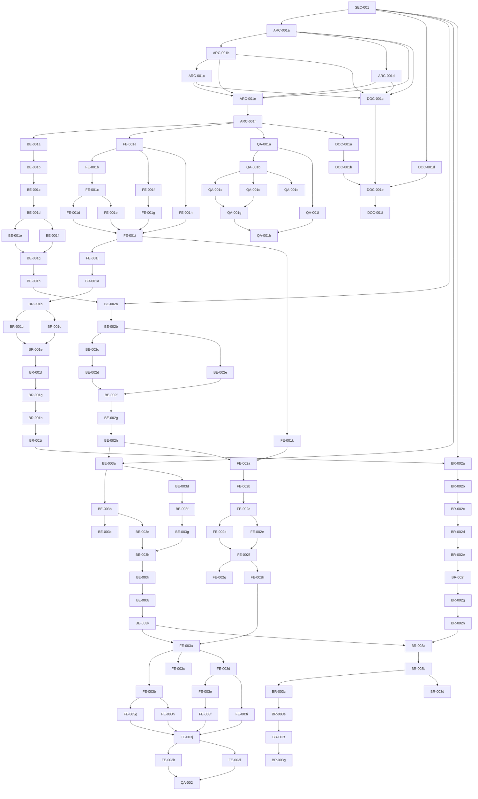

# Kanban Backlog v2 — Password Manager (Phase 0–1)

**Source:** `hermes_password_manager_step_by_step_v2.pdf` + ADR-001 + SOUL.md v5 (Task granularity rule)
**Rule:** Every task has acceptance criteria (max 3–4), a single technical responsibility, full dependency list,
assignee, test types. No task leaves `triage` without all of these.
**Note:** This v2 decomposes every original task that exceeded the granularity rule into atomic sub-tasks
(`<TASK-ID><letter>` convention). SEC-001 and ARC-001-level gates are preserved. Reconstructed after the architect
agent's OpenRouter provider (Nvidia) failed mid-generation ("Service temporarily overloaded") — rebuilt from its own
decomposition plan, so re-verify against the live Kanban once the agent is back online.

---

## SEC-001 — Threat Model + Security Gate
**Assignee:** architect
**Dependencies:** []
**Status:** triage
**Test Types:** [security-review, threat-model-validation]

### Acceptance Criteria
1. Threat model document covers all 7 minimum vectors (local file/backup access, partial API compromise, hostile extension/page, leakage via logs/errors/URLs/telemetry, stolen device/unlocked session, forgotten master password/corrupted backup/failed migration)
2. All 9 mandatory crypto decisions documented with rationale (KDF, AEAD, keys, nonce/IV, integrity, lock/unlock, recovery, backup, browser bridge)
3. Absolute rules explicitly acknowledged (no home-grown crypto, no real secrets anywhere, positive+negative tests per crypto change, synthetic fixtures only, migration/rollback strategy)
4. Signed off by Architect + QA (recorded in the document)
5. Gate blocks all downstream secret-storage tasks (BE-002, BE-003, BR-002, BR-003, FE-002, FE-003) via explicit `--parent` dependency links

*Kept as a single task — one cohesive deliverable (the gate itself), exempted from further splitting.*

---

## ARC-001 — Architecture ADRs + Repo Structure
**Dependencies (all sub-tasks' entry point):** [SEC-001]
**Status:** blocked

### ARC-001a — ADR-002: Overall Architecture
**Assignee:** architect · **Dependencies:** [SEC-001] · **Status:** blocked
**Test Types:** [architecture-review]
1. Monorepo layout, service boundaries, data flow, crypto boundaries, extension bridge contract documented
2. References ADR-001, explicitly flags any Passbolt-inspired vs. original decision

### ARC-001b — ADR-003: Data Model
**Assignee:** architect · **Dependencies:** [ARC-001a] · **Status:** blocked
**Test Types:** [architecture-review]
1. User, Vault, Resource, Folder, Tag, Permission, Group schemas documented — ownership, stable IDs, centralized authorization
2. References ADR-001 for resource/secret split and permission-mask patterns

### ARC-001c — ADR-004: API Contract
**Assignee:** architect · **Dependencies:** [ARC-001b] · **Status:** blocked
**Test Types:** [architecture-review]
1. OpenAPI 3.1 spec skeleton: envelope format, pagination, filtering, `include[]` params, soft delete, UUIDs
2. References ADR-001, explicitly flags any Passbolt-inspired vs. original decision

### ARC-001d — ADR-005: Extension Bridge Protocol
**Assignee:** architect · **Dependencies:** [ARC-001a] · **Status:** blocked
**Test Types:** [architecture-review]
1. Message types, origin validation, permission model, autofill flow documented
2. References ADR-001, explicitly flags any Passbolt-inspired vs. original decision

### ARC-001e — Repo Structure + Root Config
**Assignee:** architect · **Dependencies:** [ARC-001a, ARC-001b, ARC-001c, ARC-001d] · **Status:** blocked
**Test Types:** [repo-structure-validation]
1. Repo initialized with exact structure from spec (`apps/web/`, `apps/browser-firefox/`, `apps/services/api/`, `packages/shared/`, `tests/e2e/`, `tests/security/`, `docs/`, `architecture/adr/`)
2. Root `README.md`, `SECURITY.md`, `.gitignore`, `package.json` (workspaces), `tsconfig.base.json` created

### ARC-001f — GitHub Setup + Worktree Strategy
**Assignee:** architect · **Dependencies:** [ARC-001e] · **Status:** blocked
**Test Types:** [repo-structure-validation]
1. GitHub repo created (private), main branch protected (PR required, status checks: lint, typecheck, unit, integration, secret-scan)
2. Worktree strategy documented: `feature/<task-id>` per Kanban task

---

## BE-001 — DB + API Skeleton
**Dependencies (entry point):** [ARC-001e, ARC-001f]
**Status:** blocked

### BE-001a — DB Migration System
**Assignee:** backend · **Dependencies:** [ARC-001e, ARC-001f] · **Status:** blocked
**Test Types:** [unit]
1. Migration system initialized (Knex/Prisma/Drizzle) with baseline migration

### BE-001b — Core Tables Schema
**Assignee:** backend · **Dependencies:** [BE-001a] · **Status:** blocked
**Test Types:** [unit]
1. Core tables created: `users, vaults, resources, folders, tags, resource_tags, permissions, groups, group_members, sessions, refresh_tokens`
2. UUID PKs, timestamps, soft delete (`deleted_at`), indexes on foreign keys

### BE-001c — API Skeleton + OpenAPI + Health Endpoint
**Assignee:** backend · **Dependencies:** [BE-001b] · **Status:** blocked
**Test Types:** [integration]
1. Fastify/Express + TypeScript skeleton, OpenAPI spec served at `/openapi.json`
2. Health endpoint `GET /health` returns `{ status: "ok", version, timestamp }`

### BE-001d — Envelope Middleware
**Assignee:** backend · **Dependencies:** [BE-001c] · **Status:** blocked
**Test Types:** [unit]
1. Request/response envelope middleware: `{ header: { id, status, servertime, action, message, url, code }, body }`

### BE-001e — Query Middleware (include/filter/pagination)
**Assignee:** backend · **Dependencies:** [BE-001d] · **Status:** blocked
**Test Types:** [unit]
1. `include[]` query param parser for eager loading (permissions, tags, folder, group)
2. `filter[]` and pagination (`page`, `per_page`) middleware

### BE-001f — Error Handler + Secret Scanning CI
**Assignee:** backend · **Dependencies:** [BE-001d] · **Status:** blocked
**Test Types:** [integration, security]
1. Global error handler: consistent error envelope, no stack traces in production
2. Secret scanning in CI (gitleaks/truffleHog) — fails on any real secret

### BE-001g — Unit Tests
**Assignee:** backend · **Dependencies:** [BE-001e, BE-001f] · **Status:** blocked
**Test Types:** [unit]
1. Migration up/down, envelope middleware, include/filter parsers covered

### BE-001h — Integration Tests
**Assignee:** backend · **Dependencies:** [BE-001g] · **Status:** blocked
**Test Types:** [integration]
1. Health endpoint, OpenAPI spec validity, 404/500 envelope format covered

---

## FE-001 — Web Shell + Routing
**Dependencies (entry point):** [ARC-001e, ARC-001f]
**Status:** blocked

### FE-001a — Project Setup
**Assignee:** frontend · **Dependencies:** [ARC-001e, ARC-001f] · **Status:** blocked
**Test Types:** [unit]
1. React 18 + TypeScript + Vite app scaffolded in `apps/web/`

### FE-001b — Router + Routes
**Assignee:** frontend · **Dependencies:** [FE-001a] · **Status:** blocked
**Test Types:** [unit]
1. React Router v6 with routes: `/login, /unlock, /vault, /resources/:id, /folders, /tags, /settings, /generator`

### FE-001c — Layout Components
**Assignee:** frontend · **Dependencies:** [FE-001b] · **Status:** blocked
**Test Types:** [unit]
1. Persistent header (app name, lock button, user menu), sidebar (folder tree, tags list), main content area

### FE-001d — Theme System
**Assignee:** frontend · **Dependencies:** [FE-001c] · **Status:** blocked
**Test Types:** [unit]
1. CSS variables mapping to Hermes desktop theme, dark mode default, no hardcoded colors

### FE-001e — Accessibility Baseline
**Assignee:** frontend · **Dependencies:** [FE-001c] · **Status:** blocked
**Test Types:** [a11y]
1. Semantic HTML, ARIA landmarks, focus management on route change, keyboard navigation, WCAG 2.1 AA baseline

### FE-001f — API Client
**Assignee:** frontend · **Dependencies:** [FE-001a] · **Status:** blocked
**Test Types:** [unit]
1. Typed fetch wrapper: envelope parsing, JWT interceptor, refresh token handling, error normalization

### FE-001g — State Management
**Assignee:** frontend · **Dependencies:** [FE-001f] · **Status:** blocked
**Test Types:** [unit]
1. React Query (TanStack Query) for server state, Zustand for UI state (sidebar open, theme)

### FE-001h — Lint/Type Config + CI
**Assignee:** frontend · **Dependencies:** [FE-001a] · **Status:** blocked
**Test Types:** [integration]
1. ESLint + Prettier + TypeScript strict mode configured, CI passes

### FE-001i — Unit Tests
**Assignee:** frontend · **Dependencies:** [FE-001d, FE-001e, FE-001g, FE-001h] · **Status:** blocked
**Test Types:** [unit]
1. Router guards, API client envelope parsing, theme toggle, layout components covered

### FE-001j — Integration Tests
**Assignee:** frontend · **Dependencies:** [FE-001i] · **Status:** blocked
**Test Types:** [integration]
1. Route transitions, auth redirect (unauthenticated → `/login`), layout responsiveness covered

### FE-001k — a11y Tests
**Assignee:** frontend · **Dependencies:** [FE-001i] · **Status:** blocked
**Test Types:** [a11y]
1. axe-core on all routes, zero violations

---

## QA-001 — Test Strategy + CI Baseline
**Dependencies (entry point):** [ARC-001e, ARC-001f]
**Status:** blocked

### QA-001a — Test Strategy Document
**Assignee:** qa · **Dependencies:** [ARC-001e, ARC-001f] · **Status:** blocked
**Test Types:** [doc-validation]
1. `TEST_STRATEGY.md` covering unit/integration/security/E2E/exploratory/regression levels, tools, coverage targets, negative test requirements, synthetic data policy

### QA-001b — CI Pipeline
**Assignee:** qa · **Dependencies:** [QA-001a] · **Status:** blocked
**Test Types:** [ci-validation]
1. GitHub Actions pipeline: `install-lockfile → lint-typecheck → unit → integration → e2e → dependency-audit → secret-scan → build`
2. Each job runs on PR, blocks merge on failure

### QA-001c — Playwright MCP + Cross-Browser Config
**Assignee:** qa · **Dependencies:** [QA-001b] · **Status:** blocked
**Test Types:** [ci-validation]
1. Playwright MCP configured for E2E (Chromium, Firefox, WebKit)

### QA-001d — Security Scanning Config
**Assignee:** qa · **Dependencies:** [QA-001b] · **Status:** blocked
**Test Types:** [ci-validation, security]
1. SAST (CodeQL or Semgrep), dependency audit (npm audit/OWASP), secret scan (gitleaks) wired into CI

### QA-001e — Synthetic Fixtures + Coverage Thresholds
**Assignee:** qa · **Dependencies:** [QA-001b] · **Status:** blocked
**Test Types:** [meta]
1. Synthetic-only data generator (no real passwords, keys, tokens)
2. Coverage thresholds: unit ≥ 80%, integration ≥ 70%, critical paths (auth/vault/crypto) ≥ 90%

### QA-001f — Negative Test Checklist
**Assignee:** qa · **Dependencies:** [QA-001a] · **Status:** blocked
**Test Types:** [meta, security]
1. Checklist covers tampered ciphertext, auth abuse, leakage vectors, permission bypass, origin spoofing

### QA-001g — Evidence Collection
**Assignee:** qa · **Dependencies:** [QA-001c, QA-001d] · **Status:** blocked
**Test Types:** [ci-validation]
1. CI artifacts (test reports, coverage, scan results) uploaded on every run

### QA-001h — QA Sign-off Gate Policy
**Assignee:** qa · **Dependencies:** [QA-001g, QA-001f] · **Status:** blocked
**Test Types:** [meta]
1. No task moves to `done` without a QA verdict + evidence attached — documented and enforced

---

## DOC-001 — Dev Setup + Architecture Docs
**Dependencies (entry point):** [ARC-001e, ARC-001f]
**Status:** blocked

### DOC-001a — README.md
**Assignee:** docs · **Dependencies:** [ARC-001e, ARC-001f] · **Status:** blocked
**Test Types:** [doc-validation]
1. Project overview, architecture diagram (architecture-diagram skill), quick start, prerequisites

### DOC-001b — Dev Setup Guide
**Assignee:** docs · **Dependencies:** [DOC-001a] · **Status:** blocked
**Test Types:** [setup-reproducibility]
1. `docs/development/setup.md`: Node version, pnpm, Docker Compose for DB, env vars, migration, seed, run commands

### DOC-001c — Architecture Docs
**Assignee:** docs · **Dependencies:** [ARC-001a, ARC-001b, ARC-001c, ARC-001d] · **Status:** blocked
**Test Types:** [doc-validation]
1. `docs/architecture/`: ADR index, ADR-001 through ADR-005, component diagram, data flow diagram, deployment diagram

### DOC-001d — SECURITY.md
**Assignee:** docs · **Dependencies:** [SEC-001] · **Status:** blocked
**Test Types:** [doc-validation]
1. Threat model summary, disclosure policy, crypto decisions summary (no secret values)

### DOC-001e — Doc Policy + Validation CI
**Assignee:** docs · **Dependencies:** [DOC-001b, DOC-001c, DOC-001d] · **Status:** blocked
**Test Types:** [doc-validation]
1. All docs use synthetic examples only — no real credentials, domains, or keys
2. `markdownlint` + `vale` in CI, links checked, diagrams render

### DOC-001f — Setup Reproducibility Test
**Assignee:** docs · **Dependencies:** [DOC-001e] · **Status:** blocked
**Test Types:** [setup-reproducibility]
1. Fresh clone → follow `setup.md` → `pnpm dev` → API + Web both reachable

---

## BE-002 — Auth/Unlock Domain
**Dependencies (entry point):** [SEC-001, BE-001h]
**Status:** blocked

### BE-002a — Registration + KDF + Vault Key Storage
**Assignee:** backend · **Dependencies:** [SEC-001, BE-001h] · **Status:** blocked
**Test Types:** [unit]
1. Master password registration: KDF (per SEC-001) derives vault key, vault key encrypts empty vault
2. Stored as `{ kdfParams, salt, ciphertext, iv, tag }`

### BE-002b — Unlock Endpoint
**Assignee:** backend · **Dependencies:** [BE-002a] · **Status:** blocked
**Test Types:** [unit, integration]
1. `POST /auth/unlock` — accepts master password, runs KDF, decrypts vault key
2. Returns short-lived JWT (15m) + refresh token (30d, rotation)

### BE-002c — Lock Endpoint + Session Validation
**Assignee:** backend · **Dependencies:** [BE-002b] · **Status:** blocked
**Test Types:** [unit, integration]
1. `POST /auth/lock` — revokes access token, clears server-side session
2. `GET /auth/status` — returns vault-locked/unlocked state

### BE-002d — Session Lifetime (Auto-lock, Rotation, Restart)
**Assignee:** backend · **Dependencies:** [BE-002c] · **Status:** blocked
**Test Types:** [unit, integration]
1. Auto-lock: configurable timeout (default 15m inactivity), enforced via JWT expiry + refresh rotation
2. Sleep/restart handling: refresh token survives restart, access token re-acquired via unlock

### BE-002e — Wrong-password Handling
**Assignee:** backend · **Dependencies:** [BE-002b] · **Status:** blocked
**Test Types:** [security]
1. Constant-time comparison, generic error, rate limiting (5 attempts → 15m lockout)
2. No plaintext master password or vault key ever logged, returned, or persisted

### BE-002f — Unit Tests
**Assignee:** backend · **Dependencies:** [BE-002d, BE-002e] · **Status:** blocked
**Test Types:** [unit]
1. KDF parameter validation, unlock success/failure, lock revocation, token refresh, rate limit covered

### BE-002g — Integration Tests
**Assignee:** backend · **Dependencies:** [BE-002f] · **Status:** blocked
**Test Types:** [integration]
1. Full register → unlock → lock → status flow, concurrent sessions, refresh rotation covered

### BE-002h — Security Tests
**Assignee:** backend · **Dependencies:** [BE-002g] · **Status:** blocked
**Test Types:** [security]
1. Timing-attack resistance, brute-force protection, token replay, JWT alg confusion, secret scan on logs

---

## BE-003 — Encrypted Vault/Resource Model
**Dependencies (entry point):** [SEC-001, BE-002h]
**Status:** blocked

### BE-003a — Vault Encryption
**Assignee:** backend · **Dependencies:** [SEC-001, BE-002h] · **Status:** blocked
**Test Types:** [unit]
1. Single vault per user, encrypted with vault key (from BE-002), AEAD (per SEC-001)

### BE-003b — Resource CRUD API + Schema
**Assignee:** backend · **Dependencies:** [BE-003a] · **Status:** blocked
**Test Types:** [unit, integration]
1. `POST/GET/PATCH/DELETE /resources` — metadata in request/response, API never sees plaintext secret
2. Resource schema per ADR-003: `id, vault_id, folder_id?, name, username?, uri?, description?, resource_type, metadata_encrypted, created_at, updated_at, deleted_at`

### BE-003c — Secret Schema
**Assignee:** backend · **Dependencies:** [BE-003b] · **Status:** blocked
**Test Types:** [unit]
1. `id, resource_id, user_id, ciphertext, iv, tag, created_at, updated_at` — one secret per resource per user (for sharing)

### BE-003d — Folder CRUD + Tree + Permission Mask
**Assignee:** backend · **Dependencies:** [BE-003a] · **Status:** blocked
**Test Types:** [unit, integration]
1. `POST/GET/PATCH/DELETE /folders` — tree structure (`parent_id`), permission mask (owner/update/read)

### BE-003e — Tag CRUD
**Assignee:** backend · **Dependencies:** [BE-003b] · **Status:** blocked
**Test Types:** [unit, integration]
1. `POST/GET/PATCH/DELETE /tags` — flat, many-to-many via `resource_tags`

### BE-003f — Permission Model + Enforcement Middleware
**Assignee:** backend · **Dependencies:** [BE-003d] · **Status:** blocked
**Test Types:** [unit, security]
1. `permissions` table (aco: Resource|Folder, aco_foreign_key, aro: User|Group, aro_foreign_key, type: 1|7|15)
2. Enforcement middleware checks on every resource/folder access (read/update/owner)

### BE-003g — Folder Permission Mask Propagation
**Assignee:** backend · **Dependencies:** [BE-003f] · **Status:** blocked
**Test Types:** [unit, integration]
1. On resource create/move into folder, apply folder's permissions to resource where user has owner on it

### BE-003h — Search Endpoint
**Assignee:** backend · **Dependencies:** [BE-003e, BE-003g] · **Status:** blocked
**Test Types:** [integration]
1. `GET /resources?filter[search]=...&include=tags,folder,permissions` — searches metadata (name, username, uri)

### BE-003i — Unit Tests
**Assignee:** backend · **Dependencies:** [BE-003h] · **Status:** blocked
**Test Types:** [unit]
1. Encryption/decryption roundtrip, permission checks, mask propagation logic, search filtering covered

### BE-003j — Integration Tests
**Assignee:** backend · **Dependencies:** [BE-003i] · **Status:** blocked
**Test Types:** [integration]
1. Full resource lifecycle, folder tree ops, tag assignment, permission inheritance, sharing via group covered

### BE-003k — Security Tests
**Assignee:** backend · **Dependencies:** [BE-003j] · **Status:** blocked
**Test Types:** [security]
1. Tampered ciphertext rejected, unauthorized access denied, metadata leakage check, IV/nonce reuse detection

---

## FE-002 — Login/Unlock UI
**Dependencies (entry point):** [FE-001k, BE-002h]
**Status:** blocked

### FE-002a — Login Page
**Assignee:** frontend · **Dependencies:** [FE-001k, BE-002h] · **Status:** blocked
**Test Types:** [unit]
1. `/login`: master password input (type=password, autocomplete=off), submit → `POST /auth/unlock`, redirect to `/vault` on success

### FE-002b — Unlock Page
**Assignee:** frontend · **Dependencies:** [FE-002a] · **Status:** blocked
**Test Types:** [unit]
1. `/unlock` (for locked vault): same UI, shows "Vault locked — enter master password to unlock"

### FE-002c — Lock Button + Auto-lock Banner
**Assignee:** frontend · **Dependencies:** [FE-002b] · **Status:** blocked
**Test Types:** [unit]
1. Lock button in header: calls `POST /auth/lock`, redirects to `/unlock`
2. Auto-lock banner: countdown at 1m remaining, "Extend session" refreshes token

### FE-002d — Error States + No Leakage
**Assignee:** frontend · **Dependencies:** [FE-002c] · **Status:** blocked
**Test Types:** [unit, security]
1. Error states: wrong password (generic message), rate limited (countdown), network error (retry)
2. No master password in React state after submit, no autocomplete, no password-manager leakage

### FE-002e — Accessibility
**Assignee:** frontend · **Dependencies:** [FE-002c] · **Status:** blocked
**Test Types:** [a11y]
1. Form labels, error announcements (aria-live), focus management, keyboard-only operable

### FE-002f — Unit Tests
**Assignee:** frontend · **Dependencies:** [FE-002d, FE-002e] · **Status:** blocked
**Test Types:** [unit]
1. Form validation, submit handling, error rendering, lock button, auto-lock banner covered

### FE-002g — Integration Tests
**Assignee:** frontend · **Dependencies:** [FE-002f] · **Status:** blocked
**Test Types:** [integration]
1. Login → vault → lock → unlock flow, token refresh during session, rate-limit UI covered

### FE-002h — a11y Tests
**Assignee:** frontend · **Dependencies:** [FE-002f] · **Status:** blocked
**Test Types:** [a11y]
1. axe-core on both pages, screen-reader announcements verified

---

## FE-003 — Vault/Resource UI
**Dependencies (entry point):** [BE-003k, FE-002h]
**Status:** blocked

### FE-003a — Vault Dashboard
**Assignee:** frontend · **Dependencies:** [BE-003k, FE-002h] · **Status:** blocked
**Test Types:** [unit]
1. `/vault`: resource list (table/virtualized), columns: name, username, URI, folder, tags, actions

### FE-003b — Sidebar
**Assignee:** frontend · **Dependencies:** [FE-003a] · **Status:** blocked
**Test Types:** [unit, integration]
1. Folder tree (expand/collapse, drag-drop move), tag list (filter on click)

### FE-003c — Search Bar
**Assignee:** frontend · **Dependencies:** [FE-003a] · **Status:** blocked
**Test Types:** [unit]
1. Debounced, filters resources by name/username/uri

### FE-003d — Resource Detail Modal
**Assignee:** frontend · **Dependencies:** [FE-003a] · **Status:** blocked
**Test Types:** [unit]
1. Shows metadata, "Reveal" button (fetches + decrypts client-side), copy buttons

### FE-003e — Create/Edit Resource Form
**Assignee:** frontend · **Dependencies:** [FE-003d] · **Status:** blocked
**Test Types:** [unit]
1. Name (required), username, URI, description, folder select, tag multi-select, resource type select

### FE-003f — Password Generator Panel
**Assignee:** frontend · **Dependencies:** [FE-003e] · **Status:** blocked
**Test Types:** [unit]
1. Length, character sets, passphrase mode, entropy display, "Fill form" button

### FE-003g — Folder Management
**Assignee:** frontend · **Dependencies:** [FE-003b] · **Status:** blocked
**Test Types:** [unit, integration]
1. Create/rename/delete/move in sidebar context menu

### FE-003h — Tag Management
**Assignee:** frontend · **Dependencies:** [FE-003b] · **Status:** blocked
**Test Types:** [unit, integration]
1. Create/delete, assign/remove from resources

### FE-003i — Client-side Decryption + Optimistic Updates
**Assignee:** frontend · **Dependencies:** [FE-003d] · **Status:** blocked
**Test Types:** [unit, security]
1. Secret decrypted in memory using vault key from unlock, never persisted to localStorage/IndexedDB
2. Optimistic updates for UI responsiveness, rollback on API error

### FE-003j — Unit Tests
**Assignee:** frontend · **Dependencies:** [FE-003f, FE-003g, FE-003h, FE-003i] · **Status:** blocked
**Test Types:** [unit]
1. List filtering, form validation, generator entropy, decryption logic, optimistic-update rollback covered

### FE-003k — Integration Tests
**Assignee:** frontend · **Dependencies:** [FE-003j] · **Status:** blocked
**Test Types:** [integration]
1. Full CRUD flows, folder drag-drop, tag assign, search, generator → create covered

### FE-003l — a11y Tests
**Assignee:** frontend · **Dependencies:** [FE-003j] · **Status:** blocked
**Test Types:** [a11y]
1. Keyboard navigation across entire vault, modal focus trap, screen-reader labels, color contrast

---

## QA-002 — Critical Web E2E
**Assignee:** qa
**Dependencies:** [FE-003k, FE-003l]
**Status:** blocked
**Test Types:** [e2e, security, regression]

### Acceptance Criteria
1. Playwright suite in `tests/e2e/web/` covering critical paths: register→unlock→create resource→search→edit→lock→unlock→view secret; folder create→move resource in→permission mask applied; tag create→assign→filter; generator→create resource with generated password; wrong password→rate limit→unlock after cooldown; session expiry→auto-lock→unlock restores state
2. Security E2E: tampered ciphertext in localStorage→decrypt fails gracefully, XSS attempts in resource fields sanitized, CSP violations reported
3. Cross-browser: Chromium, Firefox, WebKit (via Playwright MCP)
4. Visual regression: snapshot comparison for vault, forms, modals (baseline committed)
5. Accessibility: axe-core on all visited pages, zero violations
6. Performance: vault load < 2s (100 resources), search debounce < 100ms
7. Evidence: videos on failure, trace.zip, screenshots, test report uploaded as CI artifact
8. All tests use synthetic data only — seeded via API before each test
9. Regression: previous critical defects (if any) have dedicated tests

*Kept as a single task — it is itself the aggregation/verification step, not an implementation task.*

---

## BR-001 — Firefox Extension Skeleton
**Dependencies (entry point):** [FE-001j]
**Status:** blocked

### BR-001a — Manifest V3 + Permissions + CSP
**Assignee:** browser · **Dependencies:** [FE-001j] · **Status:** blocked
**Test Types:** [manifest-validation]
1. Manifest V3 in `apps/browser-firefox/`; permissions limited to `activeTab, scripting, storage` + API-domain host permission
2. CSP: `script-src 'self'; object-src 'none';` — no inline scripts, no eval

### BR-001b — Background Service Worker
**Assignee:** browser · **Dependencies:** [BR-001a] · **Status:** blocked
**Test Types:** [unit]
1. `background.ts`: lifecycle, vault session state, message router

### BR-001c — Content Script
**Assignee:** browser · **Dependencies:** [BR-001b] · **Status:** blocked
**Test Types:** [unit]
1. `content.ts`: form detection (username/password fields), icon injection, `runtime.sendMessage` to background

### BR-001d — Popup
**Assignee:** browser · **Dependencies:** [BR-001b] · **Status:** blocked
**Test Types:** [unit]
1. `popup.html`+`popup.ts`: quick search, resource list, autofill trigger, lock status

### BR-001e — Message Protocol (shared package)
**Assignee:** browser · **Dependencies:** [BR-001c, BR-001d] · **Status:** blocked
**Test Types:** [unit]
1. `packages/shared`: `AUTOFILL_REQUEST, AUTOFILL_RESPONSE, LOCK_STATUS, VAULT_SEARCH, CREATE_RESOURCE` message types

### BR-001f — Origin Validation
**Assignee:** browser · **Dependencies:** [BR-001e] · **Status:** blocked
**Test Types:** [security]
1. Background only accepts messages from `moz-extension://<this-extension>` and `https://<api-domain>`

### BR-001g — Build + CI Validation
**Assignee:** browser · **Dependencies:** [BR-001f] · **Status:** blocked
**Test Types:** [ci-validation]
1. `web-ext build` produces signed `.xpi`; CI validates manifest, lint, TypeScript

### BR-001h — Unit Tests
**Assignee:** browser · **Dependencies:** [BR-001g] · **Status:** blocked
**Test Types:** [unit]
1. Message router, form detector, origin validator, vault session state machine covered

### BR-001i — Integration Tests
**Assignee:** browser · **Dependencies:** [BR-001h] · **Status:** blocked
**Test Types:** [integration]
1. Background↔content roundtrip, popup↔background, manifest validity covered

---

## BR-002 — Secure Extension Bridge
**Dependencies (entry point):** [SEC-001, BR-001i]
**Status:** blocked

### BR-002a — Vault Session Sync
**Assignee:** browser · **Dependencies:** [SEC-001, BR-001i] · **Status:** blocked
**Test Types:** [unit]
1. Extension reads vault lock state from web app via secure message (postMessage + origin check) or SameSite=Strict cookie

### BR-002b — Unlock Flow
**Assignee:** browser · **Dependencies:** [BR-002a] · **Status:** blocked
**Test Types:** [integration]
1. If locked, extension opens `/unlock` in new tab, polls for completion, then resumes

### BR-002c — Crypto Boundary + Autofill Decryption
**Assignee:** browser · **Dependencies:** [BR-002b] · **Status:** blocked
**Test Types:** [security]
1. No cryptographic operations in extension — vault key held in memory only, received via secure channel
2. Secret fetched encrypted → decrypted in background → only `{username, password}` sent to content script (never full secret object)

### BR-002d — Message Validation + Rate Limiting
**Assignee:** browser · **Dependencies:** [BR-002c] · **Status:** blocked
**Test Types:** [security]
1. Every inbound message checked for `source === 'content-script' || 'popup'` and matching origin
2. Rate limit: max 5 autofill requests/second per tab

### BR-002e — Vault Key Memory Lifetime
**Assignee:** browser · **Dependencies:** [BR-002d] · **Status:** blocked
**Test Types:** [security]
1. Vault key cleared on lock, browser sleep, extension reload

### BR-002f — Unit Tests
**Assignee:** browser · **Dependencies:** [BR-002e] · **Status:** blocked
**Test Types:** [unit]
1. Session sync, unlock flow, decryption, message validation, rate limit, key clearing covered

### BR-002g — Integration Tests
**Assignee:** browser · **Dependencies:** [BR-002f] · **Status:** blocked
**Test Types:** [integration]
1. Web-app lock→extension locks, web unlock→extension resumes, autofill end-to-end covered

### BR-002h — Security Tests
**Assignee:** browser · **Dependencies:** [BR-002g] · **Status:** blocked
**Test Types:** [security]
1. Origin spoofing rejected, message replay rejected, vault key absent from storage/console/logs, no CSP violations

---

## BR-003 — Controlled Autofill Prototype
**Dependencies (entry point):** [BR-002h, BE-003k]
**Status:** blocked

### BR-003a — Form Detection + Icon Injection + Popup Filtering
**Assignee:** browser · **Dependencies:** [BR-002h, BE-003k] · **Status:** blocked
**Test Types:** [integration]
1. Content script detects form → injects icon → click opens popup filtered to matching resources (by URI)
2. Multi-account: if multiple resources match URI, show list in popup

### BR-003b — Resource Selection → Decrypt → Fill on Click
**Assignee:** browser · **Dependencies:** [BR-003a] · **Status:** blocked
**Test Types:** [integration, security]
1. Select resource → fetch encrypted secret → decrypt in background → send to content script
2. Content script fills form fields only on explicit user click — no automatic fill

### BR-003c — Save New Credential Flow
**Assignee:** browser · **Dependencies:** [BR-003b] · **Status:** blocked
**Test Types:** [integration]
1. Detect submit on unknown form → prompt "Save to vault?" → create resource via API

### BR-003d — TOTP Support (stretch)
**Assignee:** browser · **Dependencies:** [BR-003b] · **Status:** blocked
**Test Types:** [integration]
1. If resource has TOTP secret, show current code in popup

### BR-003e — E2E Tests
**Assignee:** browser · **Dependencies:** [BR-003c] · **Status:** blocked
**Test Types:** [e2e]
1. Local test site: autofill works, save prompt works, no fill without click

### BR-003f — Security Tests
**Assignee:** browser · **Dependencies:** [BR-003e] · **Status:** blocked
**Test Types:** [security]
1. Malicious page cannot trigger fill, cross-origin iframe blocked, password field value not readable by page JS

### BR-003g — Firefox-specific CI
**Assignee:** browser · **Dependencies:** [BR-003f] · **Status:** blocked
**Test Types:** [ci-validation]
1. `browser.test` APIs for privileged test actions, `web-ext run` in CI headless

---

## Task Dependency Graph (for Kanban tooling)

---

## Notes for Dispatcher

- Every task created with explicit `--parent` links per graph above — no task uses `--initial-status blocked`
  without a parent.
- SEC-001 is the root gate; when marked `done`, dispatcher auto-promotes ARC-001a, BE-002a, BR-002a, DOC-001d.
- ARC-001f done → promotes BE-001a, FE-001a, QA-001a, DOC-001a.
- Each subsequent promotion follows the graph above; most tasks now have 1–2 acceptance criteria (max 4), single
  technical responsibility, per SOUL.md v5's Task granularity rule.
- Assignees match the 6-agent team profiles. Test types guide QA on evidence required for `review` → `done`.
- SEC-001 and QA-002 are intentionally kept as single, non-split tasks (gate / aggregation-verification role).